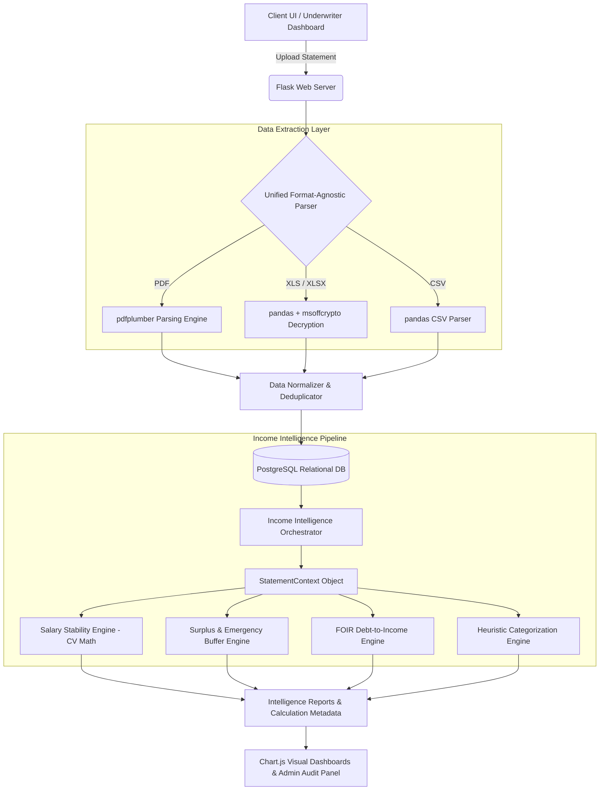

# Bank Statement Analyzer & Income Intelligence Engine

     

A full-stack financial analysis platform and enterprise engine built during the **State Bank of India (SBI)** internship. It automates the extraction, categorization, and risk assessment of raw bank statements to generate structured credit underwriting profiles.

Moving beyond simple keyword matching, this engine utilizes a deterministic 12-stage heuristic pipeline, statistical variance (Coefficient of Variation analysis), and financial liquidity ratios (FOIR, Emergency Buffer) to mathematically evaluate true income stability, gig-economy cash flows, and hidden debt obligations.

---

## 📖 Table of Contents
- [1. Abstract & Executive Summary](#1-abstract--executive-summary)
- [2. Introduction & Objectives](#2-introduction--objectives)
  - [2.1 Background of the Study](#21-background-of-the-study)
  - [2.2 Objectives](#22-objectives)
- [3. Enterprise System Architecture](#3-enterprise-system-architecture)
  - [3.1 Architectural Overview](#31-architectural-overview)
  - [3.2 Multi-Format Ingestion Pipeline](#32-multi-format-ingestion-pipeline)
  - [3.3 Containerization and Security](#33-containerization-and-security)
- [4. The Income Intelligence Engine](#4-the-income-intelligence-engine)
  - [4.1 Mathematical Foundations of Salary Detection](#41-mathematical-foundations-of-salary-detection)
  - [4.2 Coefficient of Variation (CV) & Stability Scoring](#42-coefficient-of-variation-cv--stability-scoring)
  - [4.3 The Scoring Matrix & Confidence Tagging](#43-the-scoring-matrix--confidence-tagging)
- [5. Liquidity Ratios & Financial Health](#5-liquidity-ratios--financial-health)
  - [5.1 Fixed Obligation to Income Ratio (FOIR)](#51-fixed-obligation-to-income-ratio-foir)
  - [5.2 Emergency Buffer Calculation](#52-emergency-buffer-calculation)
- [6. Categorization Engine & Data Resilience](#6-categorization-engine--data-resilience)
  - [6.1 Heuristic Categorization Modeling](#61-heuristic-categorization-modeling)
  - [6.2 Handling Corrupted & Empty Datasets](#62-handling-corrupted--empty-datasets)
- [7. Synthetic Stress Testing Methodology](#7-synthetic-stress-testing-methodology)
  - [7.1 Generation of Massive Synthetic Datasets](#71-generation-of-massive-synthetic-datasets)
  - [7.2 The 'Verified' vs. The 'Chaotic' Profiles](#72-the-verified-vs-the-chaotic-profiles)
- [8. Interactive Visualization Dashboard & Screenshots](#8-interactive-visualization-dashboard--screenshots)
- [9. Installation & Setup Guide](#9-installation--setup-guide)
- [10. Future Enhancements & V3 Roadmap](#10-future-enhancements--v3-roadmap)
- [11. Conclusion & References](#11-conclusion--references)

---

## 1. Abstract & Executive Summary

In the rapidly digitizing landscape of modern finance, the ability to accurately, swiftly, and securely evaluate a customer's creditworthiness is paramount. Traditional underwriting mechanisms rely heavily on manual inspection of bank statements, a process fraught with human error, staggering time inefficiencies, and inherent biases. 

This project details the conceptualization, architecture, and deployment of a fully autonomous **Bank Statement Analyzer and Income Intelligence Engine** designed to modernize the corporate and retail credit evaluation pipeline. Built utilizing Python, Flask, Pandas, PostgreSQL, and containerized via Docker to ensure zero data leakage, the final deliverable reduces manual statement processing times from hours to milliseconds while aggressively flagging unverified income risks.

---

## 2. Introduction & Objectives

### 2.1 Background of the Study
The global financial ecosystem is undergoing a paradigm shift toward highly interconnected, data-driven digital platforms. For banking institutions, the core product remains the issuance of credit. However, assessing credit risk has historically been an operational bottleneck. Underwriters are often presented with disparate documents—ranging from multi-page PDFs to convoluted Excel spreadsheets—each requiring meticulous line-by-line analysis. 

The Bank Statement Analyzer was engineered to act as an intelligent intermediary between raw customer data and actionable credit decisions.

### 2.2 Objectives
- **Unified Ingestion:** Develop a unified parsing architecture capable of ingesting and normalizing heterogeneous file formats (PDF, CSV, XLSX).
- **Automated Categorization:** Engineer an algorithmic engine that groups transactions into standardized buckets (Salary, EMI, Utilities, Food) using regex and keyword matching.
- **Income Intelligence:** Construct a scoring module responsible for calculating Salary Stability, Confidence Scoring, and mapping income variance.
- **Interactive Underwriting Dashboard:** Deploy a web dashboard (Flask, Chart.js) allowing underwriters to visualize transaction flows and credit metrics instantaneously.
- **Enterprise Security:** Containerize the application stack via Docker to prevent local data retention and ensure strict PII compliance.

---

## 3. Enterprise System Architecture

### 3.1 Architectural Overview
The platform follows a decoupled Model-View-Controller (MVC) paradigm utilizing Flask Blueprints, isolating database models from business logic services and frontend routing. It leverages an optimized state management pattern (`StatementContext`) to prevent expensive $O(N^2)$ dataset loops during processing.



### 3.2 Multi-Format Ingestion Pipeline
To handle unstructured PDF documents, the parser leverages `pdfplumber` to extract raw text coordinates, dynamically mapping header rows (`Date`, `Narration`, `Withdrawal`, `Deposit`, `Balance`) into a relational format. For CSV and Excel files, `pandas` and `msoffcrypto` handle decoding and decryption of password-protected statements.

### 3.3 Containerization and Security
The entire application stack is containerized using Docker Compose (`flask-web` container + `postgresql` container). Processing occurs entirely within ephemeral memory, ensuring zero client data retention on the host machine. The application is secured with Role-Based Access Control (RBAC) and Werkzeug password hashing.

---

## 4. The Income Intelligence Engine

### 4.1 Mathematical Foundations of Salary Detection
Instead of relying on simple string matching (which is vulnerable to fraud), the engine isolates credit transactions, applies weighted keyword analysis, and aggregates monthly events. It calculates the **Recurrence Ratio** across operational months to verify consistent salary patterns.

### 4.2 Coefficient of Variation (CV) & Stability Scoring
To evaluate income volatility, the engine calculates the **Coefficient of Variation (CV)**:
$$\text{CV} = \frac{\sigma}{\mu} = \frac{\text{Standard Deviation}}{\text{Mean Monthly Income}}$$

- **VERIFIED Income Profile:** $\text{CV} \le 0.20$ (Low volatility, consistent salary).
- **CHAOTIC Income Profile:** $\text{CV} > 0.20$ (High volatility, penalized score).

### 4.3 The Scoring Matrix & Confidence Tagging
The final output is an integer score (0–100) mapped to categorical tags:
- **90–100:** `VERIFIED_SALARY` (Corporate sender, high stability).
- **60–74:** `POSSIBLE_SALARY` (Requires manual review).
- **Below 60:** `UNVERIFIED_INCOME` (Flagged risk).

---

## 5. Liquidity Ratios & Financial Health

### 5.1 Fixed Obligation to Income Ratio (FOIR)
$$\text{FOIR} = \frac{\text{Total Monthly Outgoing EMIs}}{\text{Verified Monthly Income}} \times 100\%$$
Identifies recurring loan obligations to assess disposable income for underwriting.

### 5.2 Emergency Buffer Calculation
$$\text{Emergency Buffer (Months)} = \frac{\text{Average Daily Running Balance}}{\text{Average Monthly Expenditure}}$$
Evaluates how many months an applicant could survive financially if income stream ceased.

---

## 6. Categorization Engine & Data Resilience

### 6.1 Heuristic Categorization Modeling
Uses regex patterns mapped specifically to the Indian banking ecosystem (e.g., merchant gateways `RAZORPAY`, `ZOMATO` $\rightarrow$ `Food & Dining`; `BESCOM`, `MSEDCL` $\rightarrow$ `Utilities`).

### 6.2 Handling Corrupted & Empty Datasets
The Pre-Validator module detects files with $<10$ rows or $<3$ months of history, halting execution early with an `INSUFFICIENT_DATA` tag to save compute resources.

---

## 7. Synthetic Stress Testing Methodology

### 7.1 Generation of Massive Synthetic Datasets
Using `generate_scenarios.py`, the system was benchmarked against synthetic datasets scaling up to **10,000+ transactions** across 4 years of history, processing full profiles in $<50\text{ ms}$.

### 7.2 The 'Verified' vs. The 'Chaotic' Profiles
- **Verified Profile:** Static ₹95,000 salary on 1st of month $\rightarrow$ Awarded 100/100 score (`VERIFIED_SALARY`).
- **Chaotic Profile:** Fluctuating ₹5,000–₹95,000 deposits on random dates $\rightarrow$ Penalized to 40/100 score (`UNVERIFIED_INCOME`).

---

## 8. Interactive Visualization Dashboard & Screenshots

| Feature | Screenshot |
| :--- | :--- |
| **Landing Dashboard** |  |
| **Income Intelligence Engine** |  |
| **Chart.js Analytics** |  |
| **Budget Simulator** |  |
| **Liquidity Forecasting** |  |
| **Admin Audit Panel** |  |

---

## 9. Installation & Setup Guide

### Option 1: Docker Compose (Recommended)
```bash
git clone https://github.com/ManasPurnendu/Bank-Statement-Analyser.git
cd Bank-Statement-Analyser
docker-compose up -d --build
```
Access at `http://localhost:5000`.

### Option 2: Local Python Environment
```bash
python3 -m venv venv
source venv/bin/activate
pip install -r requirements.txt
python app.py
```

---

## 10. Future Enhancements & V3 Roadmap

- **Version 3 Recommendation Engine:** Next-generation recommendation layer synthesizing **V1** (transaction categorization engine) and **V2** (income stability & confidence scoring) to autonomously cross-sell tailored in-house banking products (e.g., credit cards, mutual funds, personal loan enhancements).
- **LLM Semantic Categorization:** Integrating local LLM inference (e.g., Llama 3) for ambiguous UPI narrations.
- **Asynchronous Task Queues:** Celery + Redis integration for zero-latency 50MB+ PDF statement parsing.

---

## 11. Conclusion & References

The Bank Statement Analyzer & Income Intelligence Engine bridges data engineering and credit risk assessment, delivering an enterprise-ready automated solution for commercial banking.

### Digital References
1. [Flask Documentation](https://flask.palletsprojects.com/)
2. [Pandas Data Analysis Library](https://pandas.pydata.org/)
3. [Chart.js Visualization Engine](https://www.chartjs.org/)
4. [pdfplumber Library](https://github.com/jsvine/pdfplumber)
5. [Docker Containerization Platform](https://www.docker.com/)

