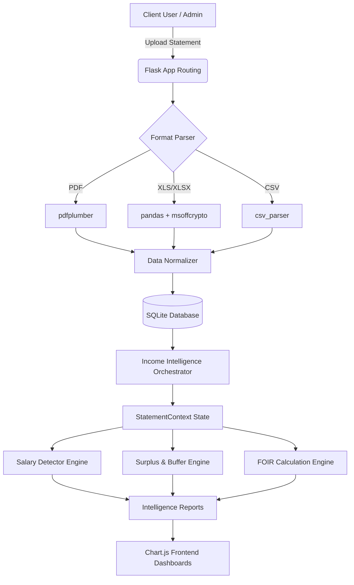

# Bank Statement Analyzer & Income Intelligence Engine

An advanced, full-stack financial analysis platform that automates the extraction, categorization, and risk assessment of raw bank statements to generate underwriter-grade credit profiles. 

Unlike naive "keyword matching" systems, this engine utilizes Explainable AI (XAI) and statistical variance to mathematically detect true income stability, gig-economy cash flows, and hidden debt obligations.

## 🚀 Key Features

- **Unified Format-Agnostic Parsers:** Seamlessly ingest and parse PDFs, CSVs, and Excel files (XLS/XLSX), including bypass support for password-encrypted documents (`msoffcrypto`, `pdfplumber`).
- **Income Intelligence Pipeline:** A robust 12-point pipeline that calculates Fixed Obligation to Income Ratios (FOIR), Surplus Cash, and Salary Stability.
- **Explainable Scoring:** Rule-based heuristics generate a `calculation_metadata` trace, explaining exactly *why* every score was awarded for strict financial auditability.
- **Robust Security & RBAC:** Role-Based Access Control, Werkzeug password hashing, and cascading SQLite schema for data privacy.
- **Dynamic Asynchronous Dashboards:** Real-time data visualization via Chart.js without requiring full page reloads.

## 🏗 Architecture Diagram



## 📸 Screenshots

*(Screenshots will be attached here)*
- **Dashboard View:** `<!-- Attach Dashboard Screenshot Here -->`
- **Upload Flow:** `<!-- Attach Upload Screenshot Here -->`
- **Income Intelligence Report:** `<!-- Attach Report Screenshot Here -->`
- **Admin Panel:** `<!-- Attach Admin Panel Screenshot Here -->`

## ⚙️ Installation & Setup

1. **Clone the repository:**
   ```bash
   git clone https://github.com/your-username/bank-statement-analyzer.git
   cd bank-statement-analyzer
   ```

2. **Create a virtual environment:**
   ```bash
   python3 -m venv venv
   source venv/bin/activate  # On Windows: venv\Scripts\activate
   ```

3. **Install dependencies:**
   ```bash
   pip install -r requirements.txt
   ```

4. **Run the Application:**
   ```bash
   python app.py
   ```
   The application will start on `http://127.0.0.1:5000/`.

## 🧪 Testing

The repository includes a synthetic data generation pipeline (`generate_scenarios.py`) capable of generating mathematically modeled, fictional transaction histories covering specific financial personas (Ideal Borrower, High-Risk Defaulter, etc.) without requiring real-world PII.

## 🔮 Future Scope

- **Product Recommendation Engine:** Next-generation recommendation layer to cross-sell targeted mutual funds and credit cards based on FOIR and surplus cash flow.

---
*Built as an internship project demonstrating full-stack engineering, complex data processing pipelines, and resilient system architecture.*