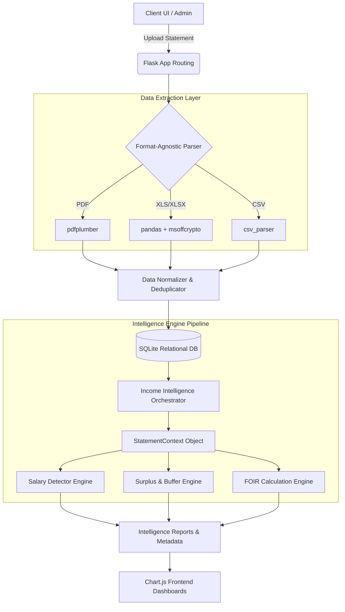
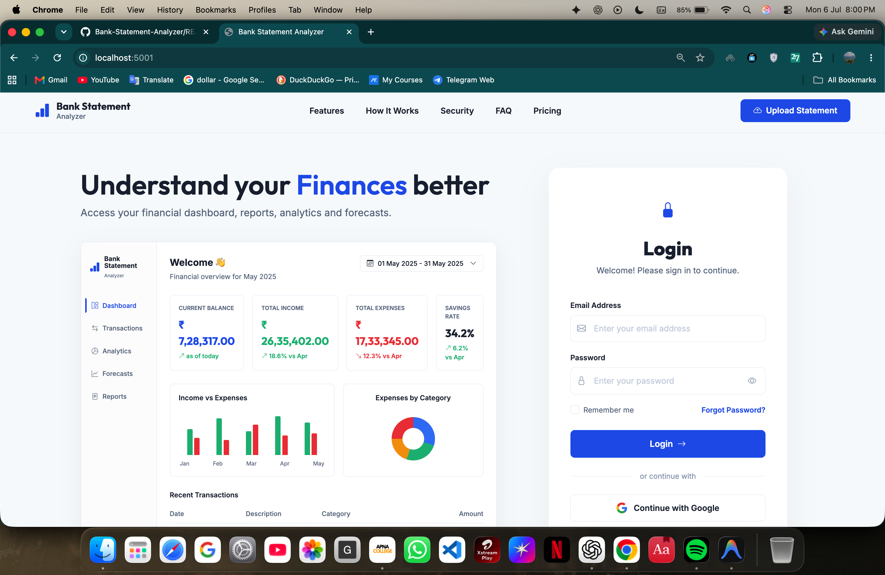
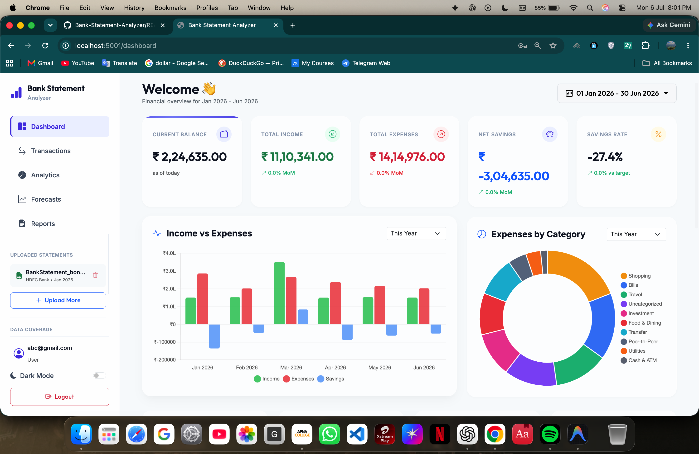
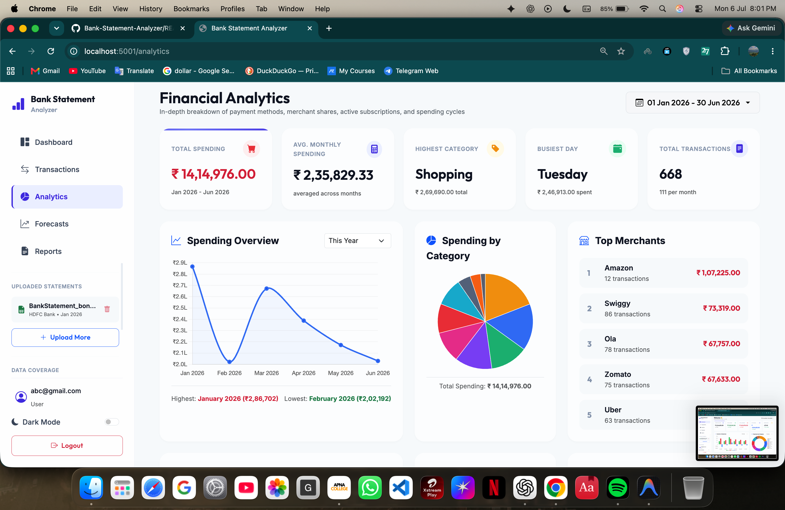
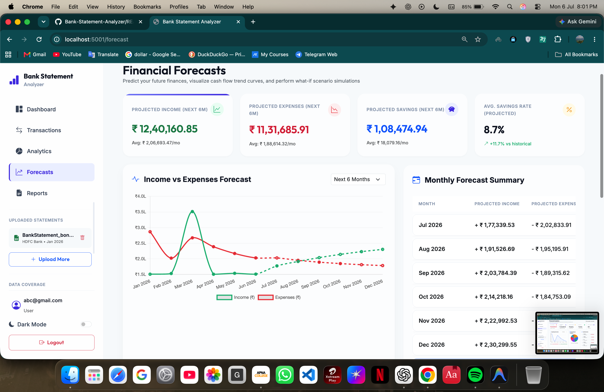
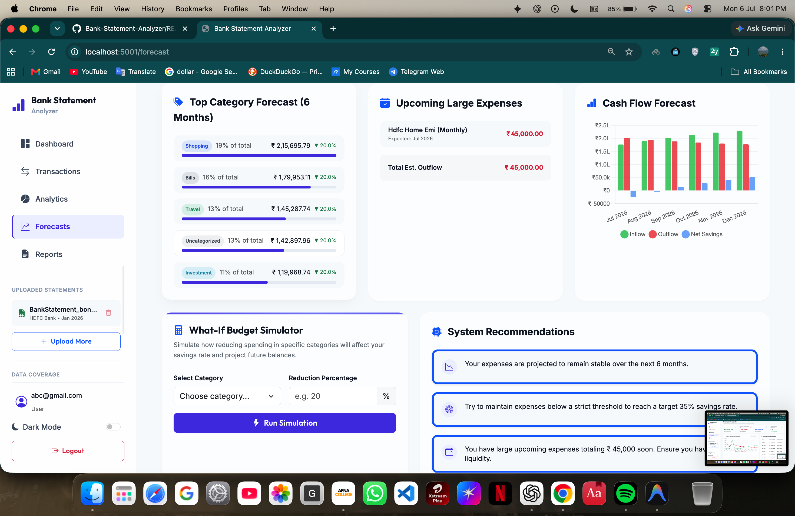
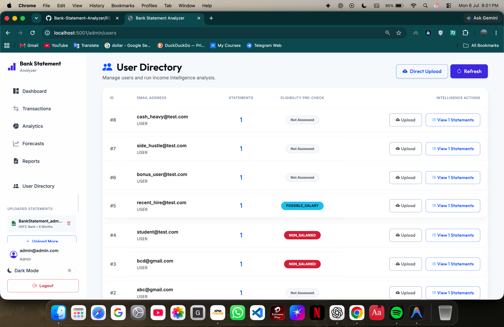
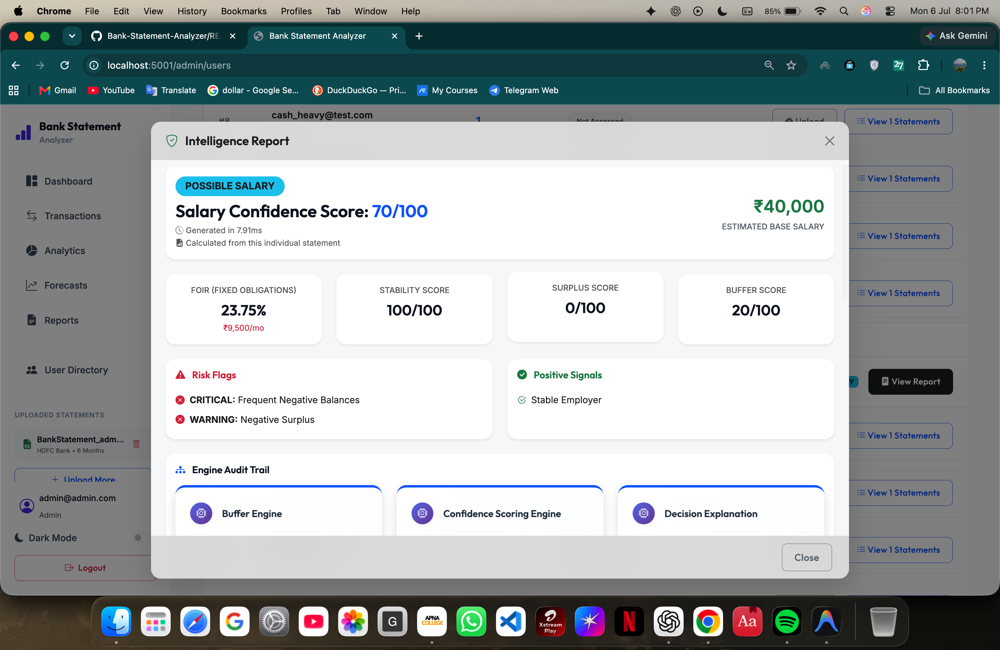
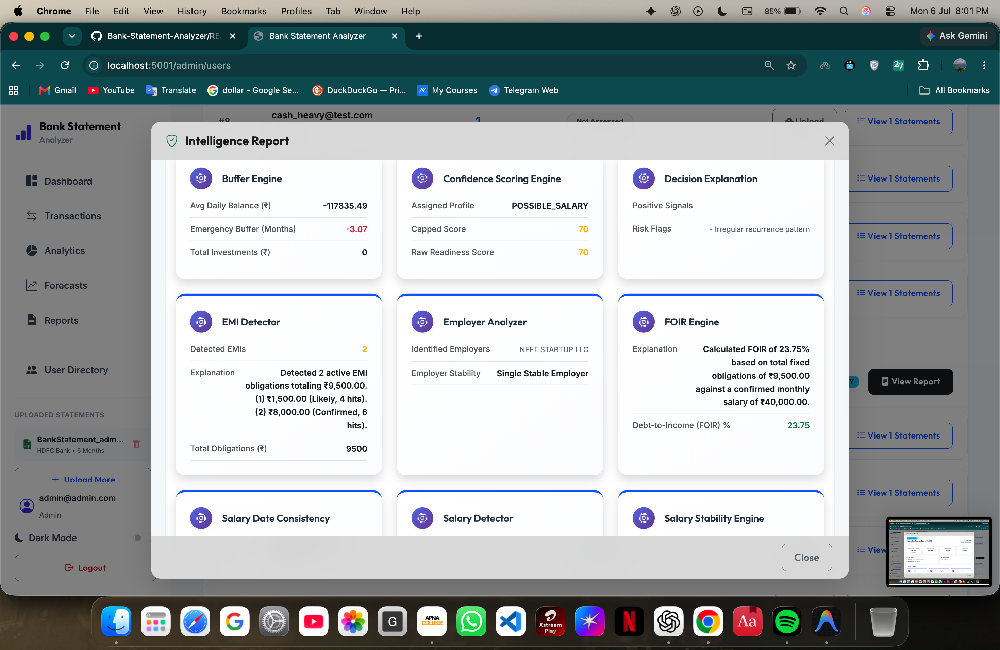
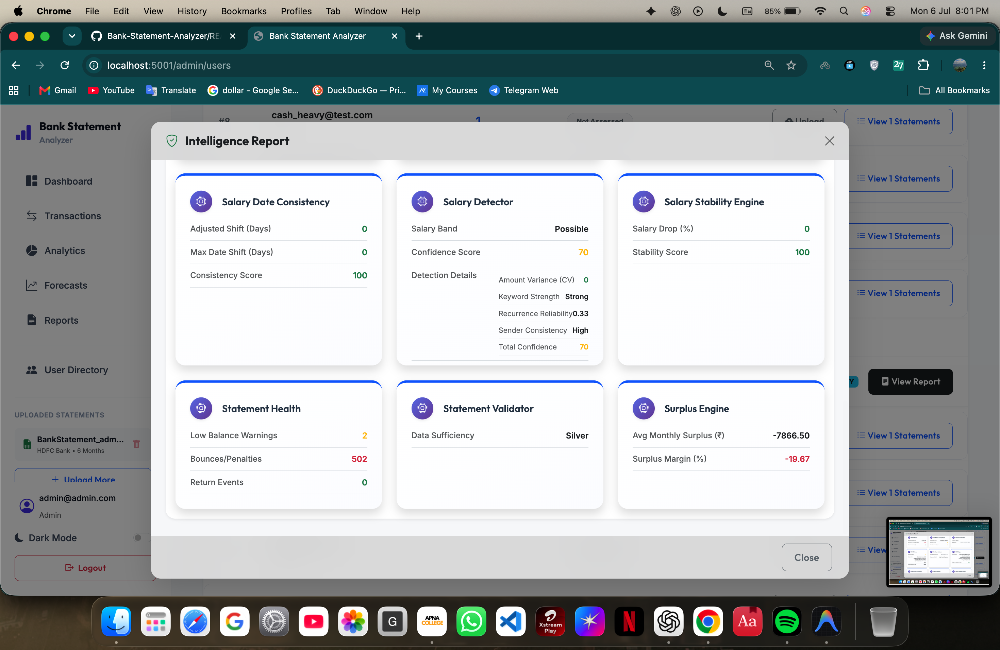

# Bank Statement Analyzer & Income Intelligence Engine

   

A full-stack financial analysis platform that automates the extraction, categorization, and risk assessment of raw bank statements to generate structured credit profiles. 

Moving beyond simple keyword matching, this engine utilizes a deterministic rule-based heuristic pipeline and statistical variance to mathematically detect true income stability, gig-economy cash flows, and hidden debt obligations.

---

## 📖 Table of Contents
- [Business Value & Problem Statement](#-business-value--problem-statement)
- [System Architecture](#-system-architecture)
- [The Income Intelligence Pipeline](#-the-income-intelligence-pipeline)
- [Data Engineering & Parsing](#-data-engineering--parsing)
- [Security & RBAC](#-security--rbac)
- [Screenshots](#-screenshots)
- [Installation & Setup](#-installation--setup)
- [Testing & Synthetic Data](#-testing--synthetic-data)
- [Future Scope](#-future-scope)

---

## 🎯 Business Value & Problem Statement

Traditional financial underwriting relies heavily on manual statement reviews or simple regex patterns to find "salary" deposits. This approach fails to account for modern gig-economy workers, hides massive outgoing debt obligations, and struggles to parse dirty, unstructured PDF data. 

**The Solution:** This project completely automates the underwriting analysis phase. By standardizing dirty data across formats (PDF, CSV, XLS) and running it through a deterministic 12-point heuristic pipeline, it provides lenders with immediate, mathematically-backed insights into a user's *true* financial health.

---

## 🏗 System Architecture

The application is structured using a Model-View-Controller (MVC) pattern utilizing Flask Blueprints, separating database models, API routing controllers, and Jinja2 templates. It utilizes an optimized state management pattern (`StatementContext`) to prevent expensive $O(N^2)$ dataset loops when passing data through the various analytical engines.



---

## 🧠 The Income Intelligence Pipeline

The analytical brain of the project consists of multiple decoupled "Engines" that sequentially mutate a central state object. Key engines include:

1. **Salary Detector & Stability Engine:**
   - Calculates the **Coefficient of Variation (CV)** and standard deviation of historical deposits.
   - Mathematically differentiates between a stable corporate salary (low CV) and volatile freelance/business income (high CV).
   - Isolates downward volatility so users aren't penalized for positive income spikes (like bonuses).
2. **Surplus & Buffer Engines:**
   - Calculates unencumbered end-of-month cash (Surplus).
   - Implements an outlier-capping algorithm to prevent massive one-off purchases (e.g., buying a car) from destroying average living expense calculations.
   - Categorizes outbound investments (Mutual Funds, Stocks) as liquid "Buffers" rather than burned cash.
3. **FOIR (Fixed Obligation to Income Ratio) Engine:**
   - Detects recurring loan payments (EMIs) via string matching and calculates the critical debt-to-income ratio used by major lending institutions.

*Crucially, all engines generate a `calculation_metadata` trace. This ensures strict auditability by explaining exactly **why** a specific score was awarded.*

---

## 🛠 Data Engineering & Parsing

- **Format-Agnostic Ingestion:** A unified pipeline capable of processing PDFs, CSVs, and Excel files interchangeably.
- **Decryption Support:** Integrates `msoffcrypto` to seamlessly bypass file encryption on password-protected documents (common with official bank statements).
- **Graceful Error Handling:** Advanced Pandas date normalization handles `NaT` (Not-a-Time) edge cases and standardizes wildly varied date formats across different banks.
- **Idempotency:** Implements dual-layer cryptographic hashing: SHA-256 on raw file bytes to prevent duplicate uploads, and MD5 on parsed transaction strings to guarantee granular idempotency and prevent duplicate database insertions.

---

## 🔒 Security & RBAC

- **Relational Schema Design:** Designed normalized SQLite tables with `ON DELETE CASCADE` constraints to strictly adhere to PII data privacy standards.
- **Authentication:** Role-Based Access Control (Admin vs. User) secured by Werkzeug password hashing.
- **Brute-Force Protection:** Implemented automatic account lockout mechanisms after consecutive failed login attempts.

---

## 📸 Screenshots

*(Screenshots will be attached here)*

### 1. The Dashboard View


*Real-time data visualization via Chart.js, rendering asynchronous spending charts driven by REST API endpoints.*

### 2. Upload & Parsing Flow


*Seamless drag-and-drop interface with password decryption support.*

### 3. Income Intelligence Report



*The final underwriter-grade output, detailing FOIR, surplus cash, and the algorithmic stability score.*

### 4. Admin Audit Panel


*Role-restricted view allowing administrators to audit user profiles and inspect calculation metadata traces.*

---

## ⚙️ Installation & Setup

1. **Clone the repository:**
   ```bash
   git clone https://github.com/ManasPurnendu/Bank-Statement-Analyser.git
   cd Bank-Statement-Analyser
   ```

2. **Create a virtual environment:**
   ```bash
   python3 -m venv venv
   source venv/bin/activate  # On Windows: venv\Scripts\activate
   ```

3. **Install dependencies:**
   ```bash
   pip install -r requirements.txt
   ```

4. **Initialize the Database:**
   *(Ensure SQLite3 is installed, then run the app to auto-generate schemas)*

5. **Run the Application:**
   ```bash
   python app.py
   ```
   The application will start locally on `http://127.0.0.1:5000/`.

---

## 🧪 Testing & Synthetic Data

Due to the highly sensitive nature of banking PII, this repository includes a **synthetic data generation pipeline** (`generate_scenarios.py`). 

This tool dynamically generates mathematically modeled, fictional transaction histories covering specific financial personas:
- *Ideal Borrower* (High stable salary, low FOIR)
- *High-Risk Defaulter* (Bouncing cheques, low surplus)
- *Gig Economy Worker* (High volatility, multiple micro-deposits)

This allows developers to rigorously stress-test the heuristics and edge cases of the intelligence pipeline without exposing real-world data.

---

## 🔮 Future Scope & Business Strategy

- **Product Recommendation Engine:** Designing a next-generation recommendation layer that leverages the Income Intelligence profiles to cross-sell and up-sell in-house financial products (e.g., tailored mutual funds, specialized credit cards, and insurance policies).
- **Targeted Marketing Integration:** By matching a user's Surplus Cash and FOIR to specific product risk profiles, the system transitions from a purely analytical tool into a proactive revenue-generating engine.

---
*Built to demonstrate full-stack engineering, complex data processing pipelines, and resilient system architecture.*